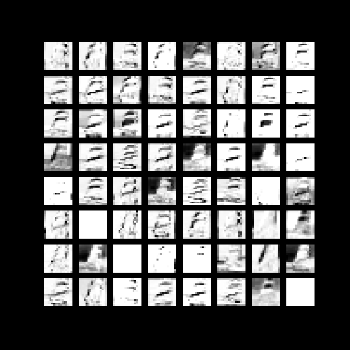
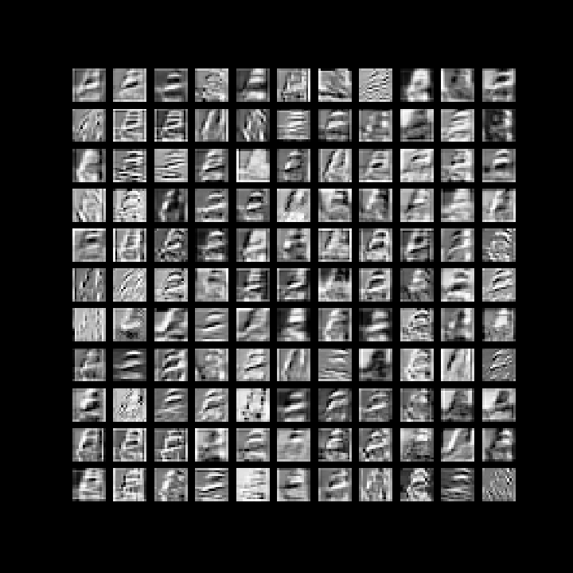

# Visualize-CNN
This repository will show how to visualize CNN intermediate layers and weights.

**Vgg11** pretrained is used for feature extraction.

## Layer Activations

These images show layer activations upto layer 5. 
<!-- 1. Implementation of [Image Style Transfer Using Convolutional Neural Networks](https://www.cv-foundation.org/openaccess/content_cvpr_2016/papers/Gatys_Image_Style_Transfer_CVPR_2016_paper.pdf) *Gatys (CVPR 2016)* paper in [Style_Transfer_Gatys_CVPR2016.ipynb](https://github.com/abhigoogol/Style-Transfer/blob/master/Style_Transfer_Gatys_CVPR2016.ipynb) Notebook

## To Do:
1. Add comments
2. Implementation of [Universal Style Transfer via Feature Transforms](https://arxiv.org/abs/1705.08086) *Yijun Li (NIPS 2017)* paper -->

## Built With

* [Pytorch](https://pytorch.org/) framework 

## License
This project is licensed under the MIT License - see the [LICENSE.md](https://github.com/abhigoogol/Visualize-CNN/blob/master/LICENSE) file for details
