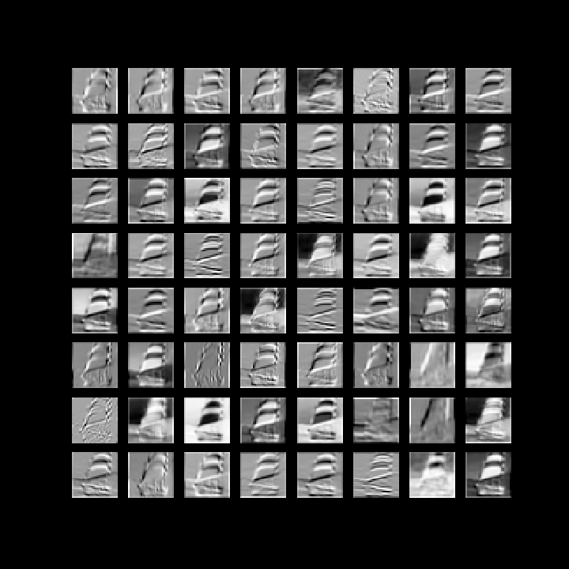

# Visualize-CNN
[Visualize CNN Notebook](https://github.com/abhigoogol/Visualize-CNN/blob/master/Visualizing_CNN_layers.ipynb) visualizes the CNN intermediate layer activations and weights.

**Vgg11** pretrained is used for feature extraction.

## Original Image

## Layer Activations

These images show layer activations upto layer 5. Details can be seen in the notebook.

## Built With

* [Pytorch](https://pytorch.org/) framework 

## License
This project is licensed under the MIT License - see the [LICENSE.md](https://github.com/abhigoogol/Visualize-CNN/blob/master/LICENSE) file for details
